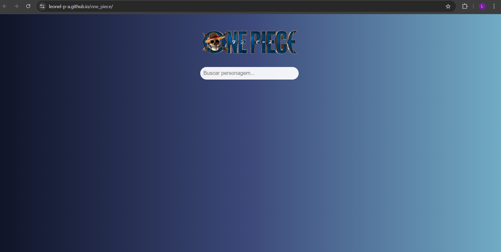
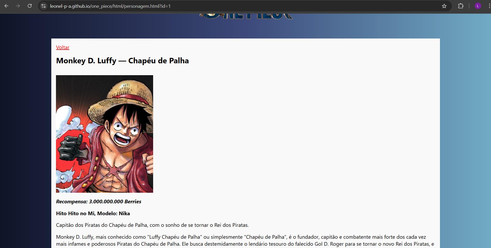

# One Piece Characters

Um projeto desenvolvido em **HTML, CSS e JavaScript** que exibe personagens do anime One Piece a partir de um arquivo JSON local.  
A aplicação possui **pesquisa dinâmica** e **página de detalhes** para cada personagem.

---

## Demonstração

O projeto está publicado no **GitHub Pages**: 

**[Clique aqui para acessar](https://leonel-p-a.github.io/one_piece)**

---

## Capturas de Tela

### Página Inicial


### Página de Detalhes do Personagem


---

## Funcionalidades

- Listagem de personagens com:
  - **Nome, alcunha, recompensa, fruta e descrição detalhada**
- **Barra de pesquisa dinâmica** que filtra em tempo real
- **Página de detalhes** de cada personagem
- Layout responsivo e estilização customizada

---

## Tecnologias utilizadas

- **HTML5** para a estrutura
- **CSS3** para o design
- **JavaScript (ES6+)** para a lógica e manipulação do DOM
- **JSON** para a base de dados de personagens
- **GitHub Pages** para hospedagem

---

## Exemplo do JSON de Personagens

O arquivo `personagens.json` segue o formato abaixo:

```json
[
  {
    "id": 1,
    "nome": "Monkey D. Luffy",
    "alcunha": "Chapéu de Palha",
    "fruta": "Gomu Gomu no Mi",
    "recompensa": "1,500,000,000",
    "imagem": "../../img/personagens/luffy.webp",
    "descricao": "Capitão dos Piratas do Chapéu de Palha. Sonha em se tornar o Rei dos Piratas.",
    "texto": "Luffy é destemido e possui uma vontade inabalável. Sua jornada o leva a desafiar grandes inimigos e proteger seus amigos a qualquer custo."
  },
  {
    "id": 2,
    "nome": "Roronoa Zoro",
    "alcunha": "Caçador de Piratas",
    "fruta": null,
    "recompensa": "320,000,000",
    "imagem": "../../img/personagens/zoro.jpg",
    "descricao": "Espadachim dos Piratas do Chapéu de Palha, mestre do estilo de três espadas.",
    "texto": "Zoro busca se tornar o maior espadachim do mundo. Sua lealdade ao capitão e sua força são lendárias."
  }
]
```
---

## Estrutura de pastas

```
│── index.html # Página inicial do projeto
│
├── assets/ # Recursos estáticos
│ ├── css/
│ │ └── style.css # Estilos da aplicação
│ │
│ ├── data/
│ │ └── personagens.json # Base de dados dos personagens
│ │
│ └── js/
│   ├── script.js # Script principal da home
│   └── script-personagem.js # Script da página de detalhes
│
├── img/ # Imagens do projeto
│ ├── personagens/ # Imagens dos personagens
| └── screenshots
│   ├── character-details.png
│   └── home-screenshot.png
│
├── pages/ # Outras páginas HTML
| ├── personagem.html # Página de detalhes dos personagens
└── LICENSE
```

---

## Como clonar e rodar localmente
```bash
  # Clone o repositório
  git clone https://github.com/Leonel-p-a/one_piece.git
  
  # Entre na pasta do projeto
  cd one_piece
  
  # Abra o arquivo index.html no navegador
  # Ou use um servidor local (ex: VS Code com Live Server)
```

---

## Como contribuir

Contribuições são bem-vindas! Para colaborar:

<ol>
  <li>Fork este repositório</li>
  <li>Crie uma branch para sua alteração:</li>

  ```bash
    git checkout -b minha-feature
  ```

  <li>Faça os commits:</li>

  ```bash
    git commit -m "Adicionei uma nova funcionalidade"
  ```

  <li>Envie para seu fork:</li>

  ```bash
    git push origin minha-feature
  ```

  <li>Abra um Pull Request para a branch main</li>
</ol>

---

## Licença

[MIT](https://choosealicense.com/licenses/mit/)